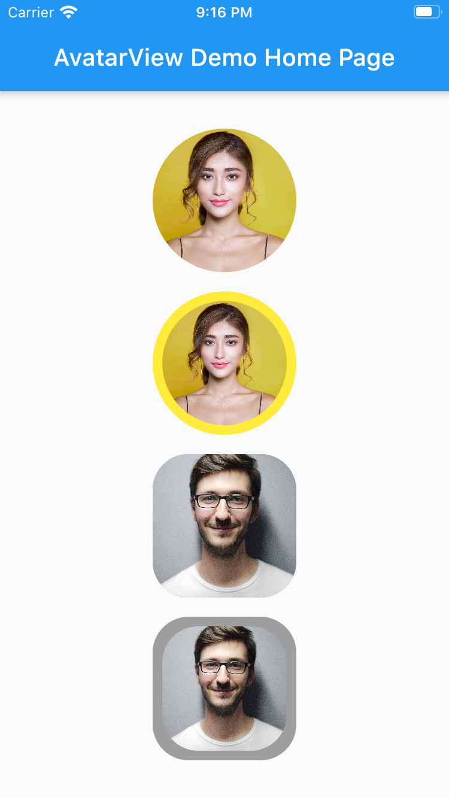
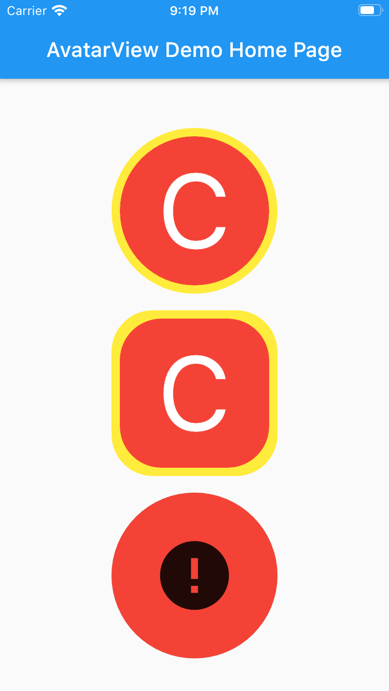

# Flutter AvatarView
AvatarView is a library which will help developers to create circular as well as rectangular avatar which includes some key features. 

## Table of contents
- **[✨ Features](#-features)**
   - [Circular AvatarView Without Border](#circular-avatarView-without-border)
   - [Circular AvatarView With Border](#circular-avatarView-with-border)
   - [Rectangular AvatarView Without Border](#rectangular-avatarView-without-border)
   - [Rectangular AvatarView With Border](#rectangular-avatarView-with-border)
   
        

#### Circular AvatarView Without Border
```dart

       AvatarView(
                  radius: 60,
                  borderColor: Colors.yellow,
                  avatarType: AvatarType.CIRCLE,
                  backgroundColor: Colors.red,
                  imagePath:
                  "https://images.pexels.com/photos/415829/pexels-photo-415829.jpeg?cs=srgb&dl=pexels-pixabay-415829.jpg",
                  placeHolder: Container(
                    child: Icon(Icons.person, size: 50,),
                  ),
                  errorWidget: Container(
                    child: Icon(Icons.error, size: 50,),
                  ),
                ),
```
#### Circular AvatarView With Border
```dart
       AvatarView(
                  radius: 60,
                  borderWidth: 8,
                  borderColor: Colors.yellow,
                  avatarType: AvatarType.CIRCLE,
                  backgroundColor: Colors.red,
                  imagePath:
                      "https://images.pexels.com/photos/415829/pexels-photo-415829.jpeg?cs=srgb&dl=pexels-pixabay-415829.jpg",
                  placeHolder: Container(
                    child: Icon(Icons.person, size: 50,),
                  ),
                  errorWidget: Container(
                    child: Icon(Icons.error, size: 50,),
                  ),
                ),
```
#### Rectangular AvatarView Without Border
```dart
       AvatarView(
                  radius: 60,
                  borderColor: Colors.grey,
                  avatarType: AvatarType.RECTANGLE,
                  backgroundColor: Colors.red,
                  imagePath:
                  "https://images.pexels.com/photos/220453/pexels-photo-220453.jpeg?cs=srgb&dl=pexels-pixabay-220453.jpg",
                  placeHolder: Container(
                    child: Icon(Icons.person, size: 50,),
                  ),
                  errorWidget: Container(
                    child: Icon(Icons.error, size: 50,),
                  ),
                ),

```

#### Rectangular AvatarView With Border
```dart
       AvatarView(
                  radius: 60,
                  borderWidth: 8,
                  borderColor: Colors.grey,
                  avatarType: AvatarType.RECTANGLE,
                  backgroundColor: Colors.red,
                  imagePath:
                  "https://images.pexels.com/photos/220453/pexels-photo-220453.jpeg?cs=srgb&dl=pexels-pixabay-220453.jpg",
                  placeHolder: Container(
                    child: Icon(Icons.person, size: 50,),
                  ),
                  errorWidget: Container(
                    child: Icon(Icons.error, size: 50,),
                  ),
                ),

```               

Please refer examples under example packabge. 

Don't forget to star⭐ /like and contribute if you want. 

# Requirements
- Any Operating System (ie. MacOS X, Linux, Windows)
- Any IDE with Flutter SDK installed (ie. Android Studio, VSCode etc)
- A little knowledge of Dart and Flutter

 
